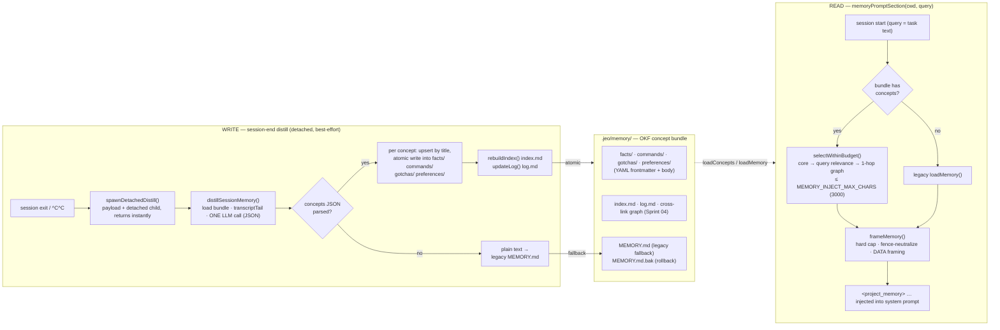

<p align="center">
  
</p>

<h1 align="center">jeo-code (jeo)</h1>

<p align="center">
  <strong>Encode intention. Decode software.</strong><br />
  Bun ベースの AI コーディングエージェント CLI — インタビュー、レビュー済みプラン、ゲート付き実行、誠実な検証。
</p>

<p align="center">
  <a href="https://github.com/akillness/jeo-code"></a>
  
  
</p>

<p align="center">
  
</p>

<p align="center">
  <a href="README.md">English</a> ·
  <a href="README.ko.md">한국어</a> ·
  <b>日本語</b> ·
  <a href="README.zh.md">中文</a>
</p>

リポジトリ内で `jeo` を実行すると、ファイルを読み・編集し・コマンドを実行してタスクを完了まで進めます — 全ステップがスクロールバック親和なインライン TUI でライブ配信されます。

## ドキュメント

📖 **[使い方ガイド](docs/usage-guide.md)** — インストール、TUI操作（↑履歴、Ctrl+O、`!`シェル）、スラッシュコマンド、`/resume`、スペックファーストワークフローをデモ動画付きで解説。

<video src="https://raw.githubusercontent.com/akillness/jeo-code/main/docs/jeo-code-promo.mp4" controls muted playsinline width="100%"></video>

> インライン再生されない場合は ▶ [デモ動画を再生/ダウンロード](docs/jeo-code-promo.mp4)。

## ハイライト

- **マルチプロバイダ・単一ループ** — Anthropic / OpenAI(+Codex) / Gemini / Antigravity / Ollama を均一な JSON ツールループで。入力欄から OAuth ログイン(`/provider login`)、モデル選択は即座にデフォルトとして永続化。
- **編集の完全性** — read 出力にコンテンツアンカー(`42ab|`)が付き、アンカー付き編集は現在のファイルと照合・行移動時は自動再マッピング・不一致時は最新内容と共に拒否されます。
- **自己修正の検証ループ** — post-edit フック(tsc / eslint / テスト)を設定すると、エージェントが診断を*自ら読み*ループ内で修正します。フックが赤のままだと `done` はブロックされます。
- **芝居なしの本物のゲート** — `ralplan` の合議はリポジトリを実際に読む critic サブエージェントで、`[OKAY]` 評決が永続化され `jeo approve` がそれを*要求*します。`ultragoal` は誠実に報告します(スイート1回実行はグローバル信号であり、基準ごとの合格を捏造しません)。
- **クラッシュ耐久・ローカルファースト** — 全状態は `.jeo/` 配下にアトミック書き込み、プロセス間ロック、失敗タスクマーカー + 再開時の部分編集警告。
- **動的ステップ予算** — 直近のツール呼び出しが新規の進捗を示す間は延長され、停滞すれば要約に収束。サブエージェントは厳密なステップ契約を維持。
- **インライン TUI** — 完了した作業は実スクロールバックに流れ(ターン中も tmux ホイール可)、エージェント実行中も通常のクエリ入力欄が表示されたまま編集できます。Ctrl+O の詳細トグル、テーマ、クリップボード画像貼り付け(Ctrl+V)、CJK/絵文字対応の幅計算。

## インストール

Bun `1.3.14+` が必要です。

```bash
bun install -g jeo-code
jeo --version
```

## クイックスタート

```bash
jeo                      # 現在のリポジトリで対話エージェント
jeo "README を整えてテストを実行して"   # ワンショット要求
jeo doctor               # 設定 + ライブモデル接続チェック
jeo setup                # API キー / OAuth / ローカルモデル設定
jeo --tmux               # 独立した tmux セッションで実行
```

## スラッシュコマンド

`jeo` REPL 内で使用(Tab 補完、`/` でパレット)。

| コマンド | 説明 |
| --- | --- |
| `/model` · `/provider` | モデル/プロバイダ選択; `/model` でデフォルト/ロールバッジ、Ralph 風の入れ子ロール・thinking 選択、OpenAI Codex ロールプリセットを一つの流れで設定 |
| `/provider login <name>` · `/logout` | 入力欄から OAuth ログイン/ログアウト |
| `/agents [role]` · `/subagent` | ロール別(executor/planner/architect/critic)モデル・thinking・ステップ設定 |
| `/thinking [level]` | デフォルト推論予算(minimal…xhigh)の表示/設定 |
| `/fast [on|off|status]` | 現在のモデルが minimal/low 推論をサポートする場合に fast thinking モードを切替 |
| `/skill` · `$<skill> [intent]` | ワークフロースキルの一覧/実行(`$team "task"` 形式) |
| `/view` · `/diff` · `/find` · `/search` | コード表示、git diff、ファイル/パターン検索 |
| `/new` · `/resume` · `/sessions` | セッション管理 |
| `/history [n|all]` · `/export` | 作業アクティビティ履歴を読みやすくスクロールバックへ再出力・トランスクリプト出力 |
| `/retry` · `/btw <q>` | 直前要求の再試行 · 履歴に残らないサイド質問 |
| `/usage` · `/context` · `/compact` | トークン使用量、コンテキスト内訳、手動コンパクション |
| `/theme` · `/config` · `/help` | テーマ、ランタイム設定、ヘルプ |
| `jeo autopilot status` | スコア方向、keep/revert 数、次アクションを示す ratchet ステータスフィールド |

## Spec-first ワークフロー

要件 → プラン → 承認 → 実行 → 検証が `.jeo/state/` で繋がり、各ハンドオフに**ブロック可能な本物のゲート**があります:

```bash
jeo deep-interview "作りたいものを説明"
jeo ralplan
jeo approve <プランパス>
jeo team
jeo ultragoal
```

- **deep-interview** — 曖昧度スコアリングのソクラテス式ループ。基準が具体的な場合のみシードを凍結(曖昧のみの基準は拒否)、シードは自身のパーサをラウンドトリップで通過する必要があります。新しいアイデアが完了済みインタビューを黙って再利用することはありません。
- **ralplan** — ドラフトパス + **リポジトリを実際に読む critic サブエージェントゲート**: `[OKAY]`/`[ITERATE]`/`[REJECT]` 評決が強制・永続化されます。無効なプラン(スキーマ・未知ロール)は complete になりません。
- **approve** — `team` が実行する契約(スキーマ+ロール)を検証し、永続化された `[OKAY]` 評決まで要求します。
- **team** — 直列プラン実行器: プロセス間ロック、stale プランのリセット、タスク別サブエージェント契約、親側の変更監査(書き込み0件の「完了」はフラグ)、失敗マーカー + 再開時の部分編集警告。
- **ultragoal** — 誠実な検証: スイートはグローバル信号として1回実行され、基準は記録されるのみで個別合格には捏造されません。

## 検証フック(自己修正)

グローバルで一度有効化(`~/.jeo/config.json` に `"hooks": { "enabled": true }`)し、プロジェクトごとに post-edit チェックを追加すると、エージェントは失敗を読み `done` の前に修正します:

```jsonc
// .jeo/hooks.json
{
  "enabled": true,
  "hooks": [
    { "event": "post-turn", "match": { "tool": "edit|write" }, "run": "bun x tsc --noEmit" }
  ]
}
```

非ゼロ終了したフックの出力はモデルが読むツール結果に付加され(バッチ内で重複排除)、フックが赤のまま `done` を呼ぶとフック名付きでプッシュバックされます。

## メモリフロー

`jeo` は `.jeo/memory/` 配下に **ローカルファースト・蒸留されたプロジェクトメモリ** を保持します(リモートバックエンドなし、ネイティブ依存ゼロ)。過去のセッションは [OKF](docs/okf_mem/) コンセプトバンドルへ蒸留され、次のセッションは関連性の高い予算内のスライスだけをシステムプロンプトへ再注入します — 指示ではなく DATA として堅牢化されます。`JEO_NO_MEMORY=1` ですべて無効化。

📐 **編集可能な図:** [`docs/diagrams/memory-flow.drawio`](docs/diagrams/memory-flow.drawio)([draw.io](https://app.diagrams.net) / デスクトップアプリで開く) — 書き込み/保存/読み込み/移行の全スイムレーン。概要:



**移行(`jeo memory-migrate`、ワンショット・冪等).** レガシーの単一ドキュメント `MEMORY.md` をロスレスでバンドルへ変換します: `## 見出し → タイプ`、各箇条書き → タイプ別コンセプト、インデント行 → 本文; `index.md`/`log.md` を再構築し、元ファイルを `MEMORY.md.bak` にリネームします。バンドルにコンセプトができた後の再実行は no-op です。**ロールバック:** `JEO_MEMORY_LEGACY=1` はバンドルを無視し、同じ注入堅牢化を通して `MEMORY.md`/`.bak` を読みます(`JEO_NO_MEMORY=1` がすべてに優先)。

## ローカルモデル

```bash
ollama pull qwen2.5:0.5b
export JEO_DEFAULT_MODEL=ollama/qwen2.5:0.5b
jeo doctor && jeo
```

## 設定

- グローバル設定: `~/.jeo/config.json`(モデル選択は MRU 永続)
- プロジェクト状態/セッション: `<project>/.jeo/`

```bash
ANTHROPIC_API_KEY=... OPENAI_API_KEY=... GEMINI_API_KEY=...
JEO_DEFAULT_MODEL=...           # 例: ollama/qwen2.5:0.5b
OLLAMA_HOST=http://localhost:11434
JEO_TUI_THEME=cosmic            # cosmic/matrix/solar/red-claw/blue-crab/mono/aurora/synthwave/sakura
JEO_TUI_ALT_SCREEN=1            # レガシー alt-screen ターン(デフォルト: インラインスクロールバック)
JEO_STEP_BASE=24                # 動的ステップ予算のローリングベース
JEO_STEP_HARD_CAP=600           # 絶対終了保証
JEO_STREAM_MAX_MS=300000        # オプトインの全体ストリーム期限(デフォルト off; スロードリップ遮断)
JEO_TOOL_OUTPUT_MAX=4000        # モデル可視のツール出力上限(全文はアーティファクトへ)
```

リトライ動作は `~/.jeo/config.json` の `retry` で調整します(`requestMaxRetries`、`streamMaxRetries`、`rateLimitRetries`、`failFastStatuses` など)。ステップ予算はデフォルトで動的 — 新規進捗が見える間は延長され、停滞時は要約に収束します。`--max-steps N` で有限フローに戻ります。

## 公開 (Publishing)

CI は `.github/workflows/npm-publish.yml` で公開します — GitHub リリース公開時に自動、または `workflow_dispatch` の手動実行(ドライラン可)。ワークフローは型チェック・テスト・トークン検証(`npm whoami`)の後、`npm publish --provenance` を実行します。

必要な npm トークン権限(リポジトリシークレット `NPM_TOKEN`):

- `jeo-code` パッケージへの Read/Write 権限を持つ **Granular Access Token**、またはクラシック **Automation** トークン
- 「公開時の **bypass 2FA**」許可が必須 — Automation トークンは常にバイパス、granular トークンはオプションの有効化が必要

## 変更履歴 (Changelog)

<!-- CHANGELOG:START (auto-generated from CHANGELOG.md — run `bun run changelog:sync`) -->
- **[0.6.39]** (2026-06-21) — A long "thinking" phase no longer trips a false stream-idle retry: reasoning/thinking deltas now act as a stream heartbeat, so a model that streams thought tokens past the idle window before any visible text is no longer mistaken for a stalled stream and retried (which discarded the in-progress reasoning). Re-verified leak-free (`mem-probe`, 2000 turns, −525 bytes/turn slope) with a fresh `jeo --tmux` boot battery (6/6).
- **[0.6.38]** (2026-06-21) — The OKF concept-bundle memory no longer silently drops what it learns: a legacy single-doc `MEMORY.md` (or a text-only distill fallback) can no longer shadow the concept bundle, break OKF conformance, or lose a turn's learnings — its content is folded into the concept merge and the stale blob is archived. Re-verified leak-free (`mem-probe`, 2000 turns, −570 bytes/turn slope) with a fresh `jeo --tmux` boot battery (6/6).
- **[0.6.37]** (2026-06-20) — Two dead-end fixes: the boxed prompt's ↑/↓ now recalls input history on a soft-wrapped one-liner (only a genuine multi-line draft gets in-box caret nav), and every terminating Spec-first stage (deep-interview, ralplan, team) now surfaces a user-visible answer instead of silently stalling — re-verified leak-free (`mem-probe`) with a fresh `jeo --tmux` boot.
- **[0.6.36]** (2026-06-20) — When `jeo --tmux` flips the mouse on so you can drag-select, the drag now actually lands on the system clipboard — the in-session tmux profile sets `set-clipboard on` + a local `copy-command` on the CURRENT session only — plus `/help` documents the drag-to-copy and the Shift/Option-drag escape hatch, re-verified leak-free (`mem-probe`) with a fresh `jeo --tmux` boot.
- **[0.6.35]** (2026-06-20) — The prompt's Ctrl+C now clears a non-empty input box on the first press and only exits on the next press of an empty box; plus app-driven system-clipboard copy (OSC 52 + local tool, tmux-aware), drag-and-drop image attachment, a Ctrl-L prompt re-anchor, and a SIGCONT resume repaint — verified leak-free (`mem-probe`) with a fresh `jeo --tmux` boot check.

See [CHANGELOG.md](CHANGELOG.md) for the full history.
<!-- CHANGELOG:END -->
