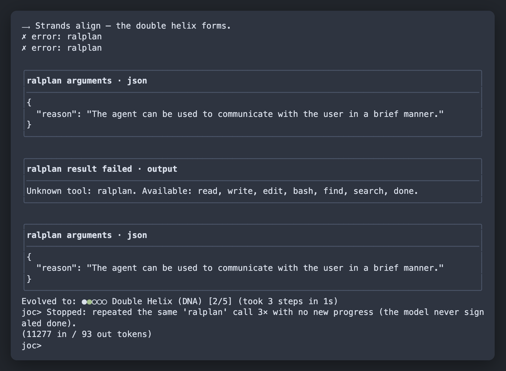

# jeo-code (`joc`)

Bun 기반 AI 코딩 에이전트 CLI입니다. 저장소 안에서 `joc`를 실행하면 파일을 읽고, 수정하고, 명령을 실행하며 작업을 끝까지 진행합니다.



진행 중에는 ASCII 진화 아트·스텝 타임라인·툴 forge 박스(bash/read/write/edit)·라이브 상태 푸터가 한 화면에 표시되고, 입력창에서 `/`로 시작하면 명령 미리보기가 하단에 노출됩니다.

## 설치

요구사항: Bun `1.3.14+`

```bash
bun install -g jeo-code
```

설치 확인:

```bash
joc --version
```

## 기본 사용법

```bash
# 대화형 코딩 에이전트 실행
joc

# 한 번의 요청을 바로 실행
joc "README를 정리하고 테스트를 실행해줘"

# 현재 설정과 모델 연결 상태 확인
joc doctor

# API 키 / OAuth / 로컬 모델 설정
joc setup
```

## 대화형 슬래시 명령어

`joc` REPL 입력창에서 사용할 수 있는 명령입니다 (`<Tab>` 자동완성 지원).

| 명령 | 설명 |
| --- | --- |
| `/model [id\|#N\|save]` | 세션 모델 설정(라이브 #N 선택·퍼지 매칭·기본값 저장) |
| `/models [refresh\|caps\|catalog]` | 로그인된 OAuth/API 모델 목록(+capability/카탈로그 표) |
| `/provider [name] [model\|#N]` | 프로바이더 자격증명·전환, 해당 프로바이더 라이브 모델 목록 |
| `/provider login <name>` | **입력창에서 바로 OAuth 로그인** (anthropic/openai/gemini) |
| `/logout <name>` | 저장된 OAuth 토큰 제거 |
| `/agents [role] [model]` · `/subagent ...` · `/subagents ...` | 서브에이전트(executor/planner/architect/critic) 역할 모델 설정 |
| `/roles [tier model]` | 모델 역할 티어(smol/slow/plan) 표시·설정 |
| `/thinking [level]` | 사고 예산(minimal/low/medium/high/xhigh) |
| `/config` | 현재 런타임 설정 표시 |
| `/view <file> [a-b]` · `/diff [file]` · `/find <glob>` · `/search <pat>` | 코드뷰 / git diff / 파일·패턴 검색 |
| `/sessions` · `/compact` · `/clear` · `/help` · `/exit` | 세션·컨텍스트 관리 |

TUI는 단계별 진행을 **스텝 타임라인**(번호·상태 색상·진행 애니메이션)과 푸터의 라이브 스텝 스트립·키 힌트 바로 표시합니다. 입력창에 `/`로 시작하는 키워드를 타이핑하면 일치하는 명령 목록이 **실시간 미리보기**로 아래에 표시되고, **방향키(↑/↓)로 선택**한 뒤 Enter로 실행할 수 있습니다(`❯` 표시). `/subagent `·`/provider login `처럼 공백 뒤 인자를 입력할 때도 사용 가능한 role/provider/subcommand 목록이 계속 보입니다.

```bash
# REPL 안에서
/provider login gemini      # 브라우저 OAuth 로그인 → 토큰 저장 → 모델 목록 자동 갱신
/models caps                # 로그인된 프로바이더의 실제 모델 + capability
/model #3                   # 방금 표시된 목록에서 3번 모델 선택
```

## 자주 쓰는 명령

```bash
# 저장된 세션 보기 / 재개
joc launch --list
joc launch --resume

# tmux 세션에서 실행
joc --tmux
joc --tmux --model gemini-2.5-flash --thinking high
joc --tmux --models --catalog gpt

# 별도 worktree에서 실행
joc --tmux --worktree ../joc-work

# 모델 목록 확인
joc models

# GJC 스타일 모델 카탈로그(정적 capability)
joc --list-models=gemini
joc --models --catalog gpt

# 실행 시 모델/프로바이더/사고 예산 지정
joc --model gemini-2.5-flash --thinking high "코드 분석해줘"
joc --provider gemini --plan "구현 계획 세워줘"
# 슬래시 명령어 팔레트
# REPL에서 "/" 또는 "/m"처럼 prefix를 입력하면 카테고리별 명령/옵션이 리스트업됩니다.
# subagent 설정은 /agents, /subagent, /subagents 모두 지원합니다.

# 인증 관리
joc auth login anthropic
joc auth status
```

## Spec-first 워크플로우

요구사항을 먼저 정리하고 계획, 실행, 검증까지 진행할 때 사용합니다.

```bash
joc deep-interview "만들고 싶은 기능 설명"
joc ralplan
joc approve <plan-path>
joc team
joc ultragoal
```

## 로컬 모델 사용

Ollama를 사용하면 API 키 없이 로컬에서 실행할 수 있습니다.

```bash
ollama pull qwen2.5:0.5b
export JOC_DEFAULT_MODEL=ollama/qwen2.5:0.5b
joc doctor
joc
```

## 설정 파일

- 전역 설정: `~/.joc/config.json`
- 프로젝트 상태/세션: `<project>/.joc/`

주요 환경 변수:

```bash
ANTHROPIC_API_KEY=...
OPENAI_API_KEY=...
GEMINI_API_KEY=...
JOC_DEFAULT_MODEL=...
OLLAMA_HOST=http://localhost:11434
```

## Publishing

Required npm token permissions:

- Use an npm **Granular Access Token** stored as `NPM_TOKEN`.
- Token type: **Automation** so CI can publish with provenance.
- npm account/package settings must allow publish automation to **bypass 2FA** for the workflow.
