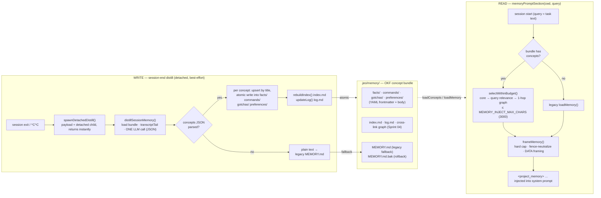

<p align="center">
  
</p>

<p align="center">
  
</p>

<h1 align="center">jeo-code (jeo)</h1>

<p align="center">
  <strong>Encode intention. Decode software.</strong><br />
  A Bun-based AI coding-agent CLI — interviews, reviewed plans, gated execution, honest verification.
</p>

<p align="center">
  <a href="https://github.com/akillness/jeo-code"></a>
  
  
</p>

<p align="center">
  
</p>

<p align="center">
  <b>English</b> ·
  <a href="README.ko.md">한국어</a> ·
  <a href="README.ja.md">日本語</a> ·
  <a href="README.zh.md">中文</a>
</p>

Run `jeo` inside a repository and it reads files, edits them, runs commands, and drives the task to completion — streaming every step live in an inline, scrollback-friendly TUI.

## Documentation

📖 **[Usage guide](docs/usage-guide.md)** — install, TUI controls (↑ recall, Ctrl+O, `!` shell), slash commands, `/resume`, and the spec-first workflow, with a demo video.

<video src="https://raw.githubusercontent.com/akillness/jeo-code/main/docs/jeo-code-promo.mp4" controls muted playsinline width="100%"></video>

> Demo not playing inline? ▶ [Play / download the demo video](docs/jeo-code-promo.mp4).

## Highlights

- **Multi-provider, one loop** — Anthropic / OpenAI (+Codex) / Gemini / Antigravity / Ollama behind a uniform JSON tool loop. OAuth login from the input box (`/provider login`), every model pick persists as the new default.
- **Edit integrity** — read output carries content anchors (`42ab|`); anchored edits are verified against the current file, re-mapped when lines shifted, and rejected with fresh content instead of corrupting.
- **Self-correcting verification loop** — configure a post-edit hook (tsc / eslint / tests) and the agent *sees* the diagnostics and fixes them in-loop; a red hook blocks `done` until resolved.
- **Real gates, no theater** — `ralplan` consensus is a repo-grounded critic subagent whose `[OKAY]` verdict is persisted and *required* by `jeo approve`; `ultragoal` reports honestly (a suite run is a global signal, never fabricated per-criterion passes).
- **Crash-durable, local-first** — all state under `.jeo/` with atomic writes, cross-process run locks, failed-task markers with partial-edit warnings on resume.
- **Dynamic step budget** — turns extend while the tool window shows novel progress and consolidate gracefully when stalled; subagents keep exact step contracts.
- **Inline TUI** — completed work flushes into real scrollback (tmux wheel works mid-turn), the normal query input box stays visible and editable while the agent runs, Ctrl+O toggles full detail, themes, clipboard image paste (Ctrl+V), CJK/emoji-safe width math.

## Install

Requires Bun `1.3.14+`.

```bash
bun install -g jeo-code
jeo --version
```

## Quick start

```bash
jeo                      # interactive agent in the current repo
jeo "Tidy the README and run the tests"   # one-shot request
jeo doctor               # config + live model connectivity check
jeo setup                # API keys / OAuth / local models
jeo --tmux               # run inside an isolated tmux session
```

## Slash commands

Inside the `jeo` REPL (Tab autocompletes; `/` opens the palette).

| Command | Description |
| --- | --- |
| `/model` · `/provider` | Pick model/provider; `/model` shows default/role badges, Ralph-style nested Set-as-role thinking choices, and the OpenAI Codex role preset in one flow |
| `/provider login <name>` · `/logout` | OAuth login/logout from the input box |
| `/agents [role]` · `/subagent` | Per-role (executor/planner/architect/critic) model · thinking · step config |
| `/thinking [level]` | Show/set default reasoning budget (minimal…xhigh) |
| `/fast [on|off|status]` | Toggle fast thinking mode when the active model advertises minimal/low reasoning |
| `/skill` · `$<skill> [intent]` | List/run workflow skills (`$team "task"` style) |
| `/view` · `/diff` · `/find` · `/search` | Code view, git diff, file/pattern search |
| `/new` · `/resume` · `/sessions` | Session management |
| `/history [n|all]` · `/export` | Reprint readable worked activity history into scrollback · transcript export |
| `/retry` · `/btw <q>` | Retry last request · side question without touching history |
| `/usage` · `/context` · `/compact` | Token usage, context breakdown, manual compaction |
| `/theme` · `/config` · `/help` | Theme, runtime config, help |
| `jeo autopilot status` | Ratchet status field with score direction, keep/revert counts, and next action |

## Spec-first workflow

Requirements → plan → approval → execution → verification, carried through `.jeo/state/` with **real, blocking gates** at every handoff:

```bash
jeo deep-interview "Describe what you want to build"
jeo ralplan
jeo approve <plan-path>
jeo team
jeo ultragoal
```

- **deep-interview** — Socratic loop with ambiguity scoring; freezes a seed only when criteria are concrete (vague-only criteria are refused) and the seed round-trips its own parser. A new idea never silently reuses a completed interview.
- **ralplan** — drafting passes plus a **repo-grounded critic subagent gate**: the critic reads the actual repository, must return `[OKAY]`/`[ITERATE]`/`[REJECT]`, and the verdict is persisted. Invalid plans (schema, unknown roles) are never marked complete.
- **approve** — validates the exact contract `team` executes (schema + roles) *and* requires the persisted `[OKAY]` consensus verdict.
- **team** — serial plan executor with a cross-process run lock, stale-plan reset, per-task subagent contracts, a parent-side mutation audit (a "completed" task with zero observed writes is flagged), and failed-task markers that warn about partial edits on resume.
- **ultragoal** — honest verification: the suite runs once as a global signal; criteria are recorded, never fabricated as individually passed.

## Verification hooks (self-correction)

Enable hooks once globally (`"hooks": { "enabled": true }` in `~/.jeo/config.json`), then add a post-edit check per project; the agent sees failures and fixes them before it may call `done`:

```jsonc
// .jeo/hooks.json
{
  "enabled": true,
  "hooks": [
    { "event": "post-turn", "match": { "tool": "edit|write" }, "run": "bun x tsc --noEmit" }
  ]
}
```

Non-zero hook output is appended to the tool result the model reads (deduped per batch); a still-red hook triggers a `done` pushback naming the hook.

## Memory flow

`jeo` keeps a **local-first, distilled project memory** under `.jeo/memory/` (no remote backend, zero native deps). Past sessions are distilled into an [OKF](docs/okf_mem/) concept bundle, and the next session injects only the relevant, budget-bounded slice back into the system prompt — hardened as DATA, never as instructions. Disable everything with `JEO_NO_MEMORY=1`.

📐 **Editable diagram:** [`docs/diagrams/memory-flow.drawio`](docs/diagrams/memory-flow.drawio) (open in [draw.io](https://app.diagrams.net) / the desktop app) — full write/store/read/migration swimlanes. Quick view:



**Migration (`jeo memory-migrate`, one-shot · idempotent).** A legacy single-doc `MEMORY.md` is converted losslessly into the bundle: `## heading → type`, each bullet → a typed concept, indented lines → body; `index.md`/`log.md` are rebuilt and the original is renamed to `MEMORY.md.bak`. Re-running is a no-op once the bundle has concepts. **Rollback:** `JEO_MEMORY_LEGACY=1` ignores the bundle and reads `MEMORY.md`/`.bak` through the same injection-hardening (`JEO_NO_MEMORY=1` still wins over everything).

## Local models

```bash
ollama pull qwen2.5:0.5b
export JEO_DEFAULT_MODEL=ollama/qwen2.5:0.5b
jeo doctor && jeo
```

## Configuration

- Global config: `~/.jeo/config.json` (model picks are MRU-persisted)
- Project state/sessions: `<project>/.jeo/`

```bash
ANTHROPIC_API_KEY=... OPENAI_API_KEY=... GEMINI_API_KEY=...
JEO_DEFAULT_MODEL=...           # e.g. ollama/qwen2.5:0.5b
OLLAMA_HOST=http://localhost:11434
JEO_TUI_THEME=cosmic            # cosmic/matrix/solar/red-claw/blue-crab/mono/aurora/synthwave/sakura
JEO_TUI_ALT_SCREEN=1            # legacy alt-screen turn (default: inline scrollback)
JEO_STEP_BASE=24                # dynamic step budget: rolling base
JEO_STEP_HARD_CAP=600           # absolute termination guarantee
JEO_STREAM_MAX_MS=300000        # opt-in overall stream deadline (default off; bounds slow-drip streams)
JEO_TOOL_OUTPUT_MAX=4000        # model-visible tool output cap (full output spills to artifacts)
```

Retry behavior is tunable via `retry` in `~/.jeo/config.json` (`requestMaxRetries`, `streamMaxRetries`, `rateLimitRetries`, `failFastStatuses`, …). The step budget is dynamic by default — it extends while recent tool calls show novel progress and consolidates with a wrap-up when stalled; `--max-steps N` restores a bounded flow.

## Publishing

CI publishes via `.github/workflows/npm-publish.yml` — triggered by a published GitHub release, or manually with `workflow_dispatch` (optional dry-run). The workflow typechecks, tests, verifies the token (`npm whoami`), then runs `npm publish --provenance`.

Required npm token permissions (repository secret `NPM_TOKEN`):

- A **Granular Access Token** with Read/Write access to the `jeo-code` package, or a classic **Automation** token
- "**bypass 2FA** for publishing" must be allowed — Automation tokens always bypass; granular tokens need the option enabled

## Changelog

<!-- CHANGELOG:START (auto-generated from CHANGELOG.md — run `bun run changelog:sync`) -->
- **[0.6.27]** (2026-06-19) — Ponytail pass on the reasoning-tier mapper, plus a real-tmux verification of `jeo --tmux`.
- **[0.6.26]** (2026-06-19) — The forge emblem is redrawn again as the mascot crayfish, foregrounding its signature pincer claws (집게).
- **[0.6.25]** (2026-06-19) — Reasoning works at every thinking level (gajae parity), and the forge emblem is redrawn as the neon-lens coding wizard.
- **[0.6.24]** (2026-06-19) — `/provider` opens an interactive onboarding selector (OAuth vs API-compatible), and OpenAI-compatible backends gain per-vendor native-reasoning formats.
- **[0.6.23]** (2026-06-19) — Live reasoning/thinking streams in the TUI across every provider, three new OpenAI-compatible backends (LM Studio, xAI, Kimi) join the auth/discovery/catalog surface, and Gemini gains native function-calling.

See [CHANGELOG.md](CHANGELOG.md) for the full history.
<!-- CHANGELOG:END -->
