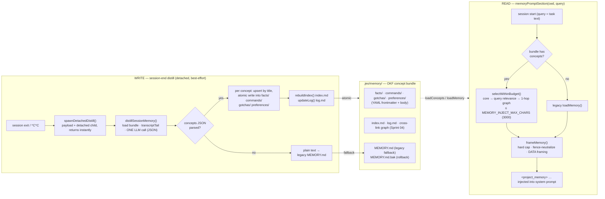

<p align="center">
  
</p>

<h1 align="center">jeo-code (jeo)</h1>

<p align="center">
  <strong>Encode intention. Decode software.</strong><br />
  基于 Bun 的 AI 编码代理 CLI — 需求访谈、经评审的计划、带门禁的执行、诚实的验证。
</p>

<p align="center">
  <a href="https://github.com/akillness/jeo-code"></a>
  
  
</p>

<p align="center">
  
</p>

<p align="center">
  <a href="README.md">English</a> ·
  <a href="README.ko.md">한국어</a> ·
  <a href="README.ja.md">日本語</a> ·
  <b>中文</b>
</p>

在仓库内运行 `jeo`，它会读取文件、编辑代码、执行命令，并把任务推进到完成 — 每一步都通过滚动友好的内联 TUI 实时呈现。

## 文档

📖 **[使用指南](docs/usage-guide.md)** — 安装、TUI 操作（↑ 历史、Ctrl+O、`!` shell）、斜杠命令、`/resume`、规格优先工作流，附演示视频。

<video src="https://raw.githubusercontent.com/akillness/jeo-code/main/docs/jeo-code-promo.mp4" controls muted playsinline width="100%"></video>

> 无法内联播放？▶ [播放/下载演示视频](docs/jeo-code-promo.mp4)。

## 亮点

- **多提供商、单一循环** — Anthropic / OpenAI(+Codex) / Gemini / Antigravity / Ollama 统一在一个 JSON 工具循环中。输入框内直接 OAuth 登录(`/provider login`)，模型选择即刻持久化为默认值。
- **编辑完整性** — read 输出携带内容锚点(`42ab|`)；带锚点的编辑会与当前文件校验、行移动时自动重映射、不匹配时连同最新内容一起拒绝 — 绝不污染文件。
- **自我修正的验证循环** — 配置 post-edit 钩子(tsc / eslint / 测试)，代理会*亲自读取*诊断并在循环内修复；钩子未通过时 `done` 会被阻断。
- **没有表演的真实门禁** — `ralplan` 共识由真正读取仓库的 critic 子代理执行，`[OKAY]` 裁决被持久化且 `jeo approve` *强制要求*它；`ultragoal` 诚实报告(套件运行只是全局信号，绝不伪造逐条通过)。
- **崩溃耐久、本地优先** — 全部状态位于 `.jeo/`，原子写入、跨进程运行锁、失败任务标记 + 恢复时的部分编辑警告。
- **动态步数预算** — 只要近期工具调用展现新的进展就持续延长，停滞时优雅收敛为总结；子代理保持精确的步数契约。
- **内联 TUI** — 已完成的工作流入真实滚动缓冲区(回合中也可用 tmux 滚轮)，代理运行时普通查询输入框仍保持可见并可编辑。Ctrl+O 详细信息切换、主题、剪贴板图片粘贴(Ctrl+V)、CJK/表情安全的宽度计算。

## 安装

需要 Bun `1.3.14+`。

```bash
bun install -g jeo-code
jeo --version
```

## 快速开始

```bash
jeo                      # 在当前仓库启动交互式代理
jeo "整理 README 并跑测试"   # 单次请求
jeo doctor               # 配置 + 模型连通性实测
jeo setup                # API 密钥 / OAuth / 本地模型配置
jeo --tmux               # 在独立 tmux 会话中运行
```

## 斜杠命令

在 `jeo` REPL 中使用(Tab 补全，输入 `/` 打开面板)。

| 命令 | 说明 |
| --- | --- |
| `/model` · `/provider` | 选择模型/提供商；`/model` 在一个流程内显示默认/角色徽章、Ralph 风格嵌套角色·thinking 选择与 OpenAI Codex 角色预设 |
| `/provider login <name>` · `/logout` | 在输入框内 OAuth 登录/登出 |
| `/agents [role]` · `/subagent` | 按角色(executor/planner/architect/critic)配置模型·thinking·步数 |
| `/thinking [level]` | 查看/设置默认推理预算(minimal…xhigh) |
| `/fast [on|off|status]` | 当前模型支持 minimal/low 推理时切换 fast thinking 模式 |
| `/skill` · `$<skill> [intent]` | 列出/运行工作流技能(`$team "任务"` 风格) |
| `/view` · `/diff` · `/find` · `/search` | 代码查看、git diff、文件/模式搜索 |
| `/new` · `/resume` · `/sessions` | 会话管理 |
| `/history [n|all]` · `/export` | 将可读的工作活动历史重新输出到滚动区 · 导出记录 |
| `/retry` · `/btw <问题>` | 重试上次请求 · 不写入历史的旁路提问 |
| `/usage` · `/context` · `/compact` | Token 用量、上下文明细、手动压缩 |
| `/theme` · `/config` · `/help` | 主题、运行时配置、帮助 |
| `jeo autopilot status` | 显示分数方向、keep/revert 次数和下一步动作的 ratchet 状态字段 |

## Spec-first 工作流

需求 → 计划 → 批准 → 执行 → 验证，经由 `.jeo/state/` 串联，每次交接都有**可阻断的真实门禁**:

```bash
jeo deep-interview "描述你想构建的东西"
jeo ralplan
jeo approve <计划路径>
jeo team
jeo ultragoal
```

- **deep-interview** — 基于歧义度评分的苏格拉底循环；只有标准足够具体才冻结种子(纯含糊标准会被拒绝)，且种子必须通过自身解析器的往返校验。新想法绝不会静默复用已完成的访谈。
- **ralplan** — 起草阶段 + **真正读取仓库的 critic 子代理门禁**: 强制并持久化 `[OKAY]`/`[ITERATE]`/`[REJECT]` 裁决。无效计划(schema、未知角色)不会被标记为 complete。
- **approve** — 校验 `team` 执行的确切契约(schema+角色)，并要求持久化的 `[OKAY]` 共识裁决。
- **team** — 串行计划执行器: 跨进程运行锁、过期计划重置、按任务的子代理契约、父侧变更审计(零写入的"完成"会被标记)、失败标记 + 恢复时的部分编辑警告。
- **ultragoal** — 诚实验证: 套件作为全局信号只运行一次，标准只被记录，绝不伪造为逐条通过。

## 验证钩子(自我修正)

先全局启用一次(在 `~/.jeo/config.json` 中设置 `"hooks": { "enabled": true }`)，再为项目添加 post-edit 检查，代理会读取失败并在 `done` 之前修复:

```jsonc
// .jeo/hooks.json
{
  "enabled": true,
  "hooks": [
    { "event": "post-turn", "match": { "tool": "edit|write" }, "run": "bun x tsc --noEmit" }
  ]
}
```

非零退出钩子的输出会附加到模型读取的工具结果中(批内去重)；钩子未通过就调用 `done` 会收到带钩子名称的回推。

## 内存流程

`jeo` 在 `.jeo/memory/` 下保存 **本地优先、蒸馏后的项目内存**(无远程后端,零原生依赖)。过往会话被蒸馏为 [OKF](docs/okf_mem/) 概念包,下一次会话仅把相关的、受预算约束的切片重新注入系统提示 —— 作为 DATA 而非指令加固。用 `JEO_NO_MEMORY=1` 完全禁用。

📐 **可编辑图示:** [`docs/diagrams/memory-flow.drawio`](docs/diagrams/memory-flow.drawio)(在 [draw.io](https://app.diagrams.net) / 桌面应用中打开)—— 写入/存储/读取/迁移完整泳道。概览:



**迁移(`jeo memory-migrate`,一次性 · 幂等).** 把旧版单文档 `MEMORY.md` 无损转换为概念包: `## 标题 → 类型`,每个项目符号 → 一个类型化概念,缩进行 → 正文; 重建 `index.md`/`log.md`,并把原文件重命名为 `MEMORY.md.bak`。一旦概念包中已有概念,再次运行即为 no-op。**回滚:** `JEO_MEMORY_LEGACY=1` 忽略概念包,通过相同的注入加固读取 `MEMORY.md`/`.bak`(`JEO_NO_MEMORY=1` 仍优先于一切)。

## 本地模型

```bash
ollama pull qwen2.5:0.5b
export JEO_DEFAULT_MODEL=ollama/qwen2.5:0.5b
jeo doctor && jeo
```

## 配置

- 全局配置: `~/.jeo/config.json`(模型选择 MRU 持久化)
- 项目状态/会话: `<project>/.jeo/`

```bash
ANTHROPIC_API_KEY=... OPENAI_API_KEY=... GEMINI_API_KEY=...
JEO_DEFAULT_MODEL=...           # 例: ollama/qwen2.5:0.5b
OLLAMA_HOST=http://localhost:11434
JEO_TUI_THEME=cosmic            # cosmic/matrix/solar/red-claw/blue-crab/mono/aurora/synthwave/sakura
JEO_TUI_ALT_SCREEN=1            # 旧版 alt-screen 回合(默认: 内联滚动缓冲)
JEO_STEP_BASE=24                # 动态步数预算的滚动基数
JEO_STEP_HARD_CAP=600           # 绝对终止保证
JEO_STREAM_MAX_MS=300000        # 可选的整体流截止(默认关闭; 约束慢滴流)
JEO_TOOL_OUTPUT_MAX=4000        # 模型可见的工具输出上限(全文溢出到 artifacts)
```

重试行为通过 `~/.jeo/config.json` 的 `retry` 调整(`requestMaxRetries`、`streamMaxRetries`、`rateLimitRetries`、`failFastStatuses` 等)。步数预算默认动态 — 只要看到新的进展就延长，停滞时收敛为总结；`--max-steps N` 恢复有界流程。

## 发布 (Publishing)

CI 通过 `.github/workflows/npm-publish.yml` 发布 — GitHub 发布 release 时自动触发，或手动 `workflow_dispatch`(可选 dry-run)。工作流执行类型检查、测试、令牌校验(`npm whoami`)后运行 `npm publish --provenance`。

所需 npm 令牌权限(仓库 secret `NPM_TOKEN`):

- 对 `jeo-code` 包具有 Read/Write 权限的 **Granular Access Token**，或经典 **Automation** 令牌
- 必须允许"发布时 **bypass 2FA**" — Automation 令牌始终绕过，granular 令牌需启用该选项

## 更新日志 (Changelog)

<!-- CHANGELOG:START (auto-generated from CHANGELOG.md — run `bun run changelog:sync`) -->
- **[0.6.18]** (2026-06-17) — Memory data-flow diagram and a README "Memory flow" section documenting the actual runtime behavior.
- **[0.6.17]** (2026-06-17) — Legacy MEMORY.md migrates losslessly into the OKF concept bundle, with a one-shot command and a rollback toggle.
- **[0.6.16]** (2026-06-17) — OKF memory grows a concept cross-link graph: 1-hop search expansion, bundle lint, graphify-optional.
- **[0.6.15]** (2026-06-17) — Query-aware OKF memory injection with budget-priority selection, and a truthful end-of-turn Todos receipt.
- **[0.6.14]** (2026-06-16) — Memory distillation survives malformed model output, and stream-idle stalls retry instead of failing the turn.

See [CHANGELOG.md](CHANGELOG.md) for the full history.
<!-- CHANGELOG:END -->
